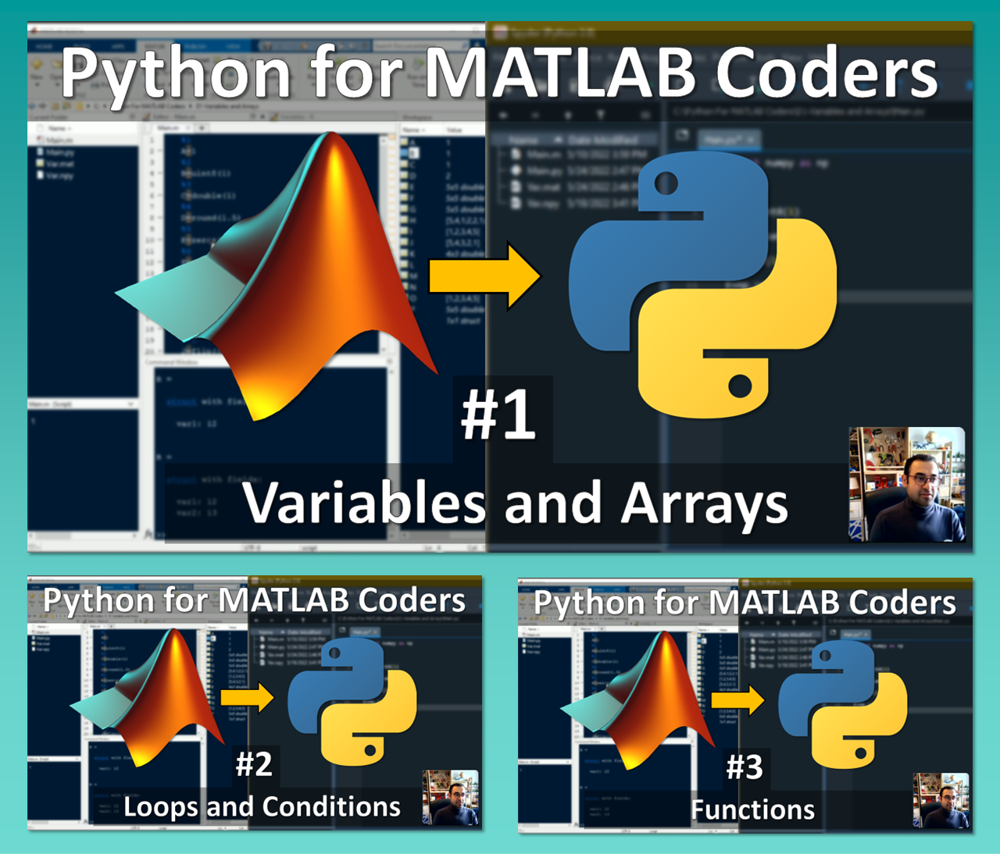

# Matlab2Python
Python for MATLAB coders

This is the repository of a series of tutorials on how to translate a MATALB code into python. 
You can find the videos in this Youtube playlist: 
https://www.youtube.com/watch?v=OV9A72ICuEA&list=PLaYes2m4FtR2v6mp5sYwjU9rOCtlpkcdG

